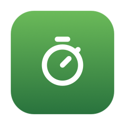

# thyme-ng

A menu bar stopwatch for macOS.

`thyme-ng` is a complete rewrite of [Thyme](https://github.com/joaomoreno/thyme)
by João Moreno. The original is Objective-C from 2010 to 2015, with manual
retain and release, `.xib` files, a Core Data XML store, the Growl notification
framework, and a deployment target of macOS 10.7. It no longer builds on a
current Mac. This version keeps the behaviour and replaces the whole
implementation.



## What it does

- Counts time from the menu bar. It shows `MM:SS`, then `HH:MM:SS` after an hour.
- Start, pause, continue, restart and finish.
- Stores each finished session with its date and an optional tag.
- Exports every session to JSON.
- Global hot keys that work in any application.
- Pauses when the Mac sleeps or the screen locks, and continues afterwards.
- Deletes old sessions automatically, so the list stays short.
- Starts at login, if you want it to.
- Responds to AppleScript, Shortcuts and Spotlight.

## Requirements

| Item | Value |
| --- | --- |
| macOS | 15.0 or later |
| Hardware | Apple silicon and Intel (universal binary) |
| Xcode | 26 or later, to build it |

## Build and install

```bash
make install     # build the Release app and copy it to /Applications
open /Applications/thyme-ng.app
```

Other targets:

```bash
make build       # build only
make test        # run the unit tests
make run         # build, then launch
make generate    # rebuild ThymeNG.xcodeproj from project.yml (needs xcodegen)
make uninstall   # remove /Applications/thyme-ng.app
```

To work in Xcode, open `ThymeNG.xcodeproj` and press Run. The project signs
ad hoc by default, which is enough for your own Mac. To sign with your Apple ID,
select the `ThymeNG` target, open **Signing & Capabilities**, and choose your
team.

`ThymeNG.xcodeproj` is generated from `project.yml`, but it is committed, so you
do not need XcodeGen unless you change the project layout.

## Settings

Open **Preferences…** from the menu, or press <kbd>⌘</kbd><kbd>,</kbd>.

| Setting | Default | What it does |
| --- | --- | --- |
| Pause during sleep | on | Pauses when the Mac sleeps, continues on wake. |
| Pause during screensaver or screen lock | on | Same, for the screen. |
| Ask for a tag when a session finishes | off | Shows a small window to label the session. |
| Show notifications | on | A banner on start, pause and stop. |
| Delete old sessions automatically | on, keep 10 | Keeps only the newest N sessions. |
| Start thyme-ng at login | off | Registers a login item through `SMAppService`. |

The **Shortcuts** tab holds the three global hot keys: Start / Pause, Restart
and Finish. No shortcut is set until you record one.

## Automation

### AppleScript

```applescript
tell application "thyme-ng" to start
tell application "thyme-ng" to pause
tell application "thyme-ng" to toggle
tell application "thyme-ng" to restart
tell application "thyme-ng" to stop
tell application "thyme-ng" to elapsed   -- returns "12:34"
```

From a terminal:

```bash
osascript -e 'tell application "thyme-ng" to toggle'
```

The suite keeps the original command names, so a script written for Thyme works
after you change the application name.

### Shortcuts and Spotlight

The same commands are App Intents, so they appear in the Shortcuts app under
**thyme-ng**: Start Timer, Pause Timer, Toggle Timer, Finish Timer and Get
Elapsed Time.

## Export format

`Export…` writes a JSON array, newest session first:

```json
[
  {
    "date" : "2026-08-11T09:30:00+01:00",
    "duration" : 3661,
    "tag" : "writing"
  }
]
```

`duration` is a whole number of seconds. This is the same shape the original app
exported.

## Where the data lives

| What | Where |
| --- | --- |
| Sessions | `~/Library/Application Support/thyme-ng/thyme-ng.store` (SwiftData) |
| Settings | `~/Library/Preferences/com.fabrizioballiano.thyme-ng.plist` |

The old Thyme database at `~/Library/Application Support/Thyme/storedata` is not
read. `thyme-ng` starts with an empty list.

## How it is built

| Part | Choice |
| --- | --- |
| Language | Swift 6, strict concurrency |
| Interface | SwiftUI `MenuBarExtra`, `Settings` |
| Storage | SwiftData |
| Notifications | `UserNotifications` (replaces Growl) |
| Global hot keys | [KeyboardShortcuts](https://github.com/sindresorhus/KeyboardShortcuts) (replaces the vendored Carbon code and ShortcutRecorder) |
| Login item | `SMAppService` |
| Tests | Swift Testing |
| Project file | XcodeGen |

### Layout

```
Sources/ThymeNG/
├── ThymeNGApp.swift        the scenes
├── AppModel.swift          the one controller
├── Stopwatch.swift         the timer engine
├── Session.swift           the stored model
├── SessionStore.swift      read, write, prune, export
├── Preferences.swift       the settings
├── HotKeys.swift           the global shortcut names
├── SystemEvents.swift      sleep, wake, screensaver, lock
├── Notifier.swift          banners
├── LoginItem.swift         start at login
├── TimeFormatter.swift     MM:SS and HH:MM:SS
├── Views/                  the menu, the settings, the tag prompt
└── Scripting/              AppleScript commands and App Intents
```

Every command has one code path. The menu, a hot key, an AppleScript command and
a Shortcuts action all call the same method on `AppModel`.

### Differences from the original

- The elapsed time is computed from a monotonic clock, so a change of the system
  clock cannot corrupt a running session.
- The menu bar clock keeps counting while the menu is open. The original froze,
  because its timer ran in the default run loop mode.
- A running session is stored when you quit. The original threw it away.
- The tag window's second button is called `Skip`, not `Cancel`. It stores the
  session without a tag. The original called it `Cancel` but stored the session
  as well.
- The original read the tag preference under the key `askForTagOnFinishButton`
  while it registered the default under `askForTagOnFinish`, so the default never
  applied. There is one key now.
- Sessions store one duration in seconds instead of three separate fields.
- Digits are monospaced, so the menu bar item no longer jumps between two fixed
  widths.

## Licence

MIT. See [LICENSE](LICENSE).

Third-party material is listed in [NOTICE.md](NOTICE.md).
